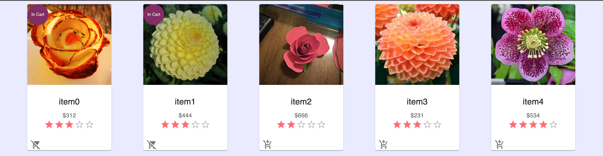

# Vention MachineCloud test

This test will consist of building a very simple application which represents a marketplace.

## Sneak Peek



## What you need to build

- [x] An application using React that will display a list of items that you can add to your cart
- [x] When you add an item to your cart it should be represented in the UI
- [x] You should be able to remove products from the cart
- [x] You must add the ability to rate products with a score from (1 to 5)
- [x] Provide instructions in the README to launch the application

## Bonus points

- [x] **Use TypeScript**
- [x] Implement a backend and persist the state in a database
- [x] Have a single command to launch the whole application
- [x] Use the open-source project [stator](https://github.com/chocolat-chaud-io/stator) as a template for your application

## Quick look at docker-compose
                  ┌─────────────────────┐
                  │      webapp         │
                  │   container_name:   │
                  │  webapp-full-stack  │
                  └─────────────────────┘
                            │
                            │
                            ▼
                  ┌───────────────────┐
                  │       api         │
                  │  container_name:  │
                  │  api-full-stack   │
                  └───────────────────┘
                            │
                            │
                            ▼
         ┌────────────────────────────────────────────┐
         │                nginx                       │
         │ container_name: load-balancer-health-check │
         └────────────────────────────────────────────┘
                            │
                            │
                            ▼
         ┌────────────────────────────────────────┐
         │               database                 │
         │           container_name:              │
         │     mashed_app-postgres-full-stack     │
         └────────────────────────────────────────┘

## 🚀 Getting Started

### Prerequisites

- [Docker Engine](https://docs.docker.com/engine/)
- [Docker Compose](https://docs.docker.com/compose/install/)
- [node.js](https://nodejs.org/en/download/) >=14.x <15.0.0

## Run the application

### From Script

simply run:

```
sh install.sh
```

### Manually

1- Install the dependencies:

```
npm i
```

2- Build:

```
npm run build
```

3- Run

```
docker compose up
```
